# Grupo MasAvocadosNo

Jose Niguidula

## Repositorio github: [https://github.com/jniguidula/uoc-proyecto3](https://github.com/jniguidula/uoc-proyecto3)

## Proyecto github: [https://github.com/users/jniguidula/projects/1](https://github.com/users/jniguidula/projects/1)

# Proyecto Final - Análisis de Datos Avanzado

Opción de continuar y ampliar el **"proyecto-1-regresion"**.

*   creación de repositorio en github como repositorio de código, archivos y control de versiones.
*   branch 'main' como unica rama al optar por trabajar en solitario
*   creación de un proyecto github 'uoc-proyecto3' como herramienta de planificación.
    *   creación de tareas como 'backlog' siguiendo los requisitos obligatorios del proyecto.
    *   asignación y cambios de estado de las tareas, creación de 'issues' para poder ligar la tarea con el repositorio github.
    *   actualizacion de fechas de inicio y fin de las tareas y prioridad.
    *   definición de tareas gestionables con sprints de 1 semana con la finalidad de hacer entregas parciales pero tangibles en modo agile.

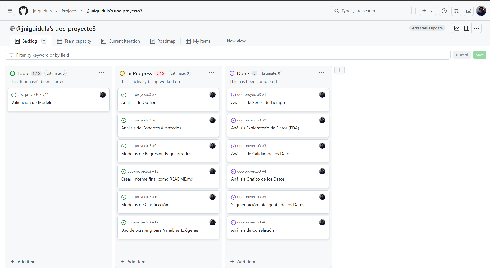

*   Para ampliar la CSV del proyecto 1, utilizamos un dataset de kaggle.com con información de Hass Avocados de 2015 hasta 2023 para ampliar el  proyecto-1
    *   [https://www.kaggle.com/datasets/vakhariapujan/avocado-prices-and-sales-volume-2015-2023](https://www.kaggle.com/datasets/vakhariapujan/avocado-prices-and-sales-volume-2015-2023)

## Objetivos del proyecto

1.  Ampliar la exploración y analisis de datos el proyecto-1 con datos actualizados hasta diciembre 2023.
2.  Verificar continuidad de la evolución de precios y volumenes con el proyecto-1
3.  Implementar modelos de regresión regularizados (como Ridge, Lasso, ElasticNet), utilizando técnicas de búsqueda de hiperparámetros para optimizar el rendimiento del modelo.
4.  Presentar los resultados de la validación cruzada (k-fold) y realizar un análisis de los residuos.

**Informe del Análisis Exploratorio de Datos (EDA) y Calidad de los Datos**:

*   el archivo csv actualizado incluye datos hasta 2023 y las caracteristicas son parecidas al csv del proyecto 1:

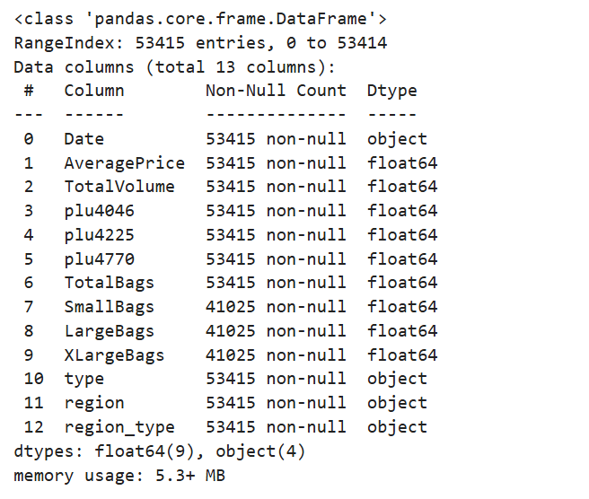

*   faltaba la columna 'year' y procedimos a crear la nueva columna.
*   regularizamos la columna 'Date' para poder tratarlo en python.
*   creamos la nueva columna region\_type para agrupar clasificaciones segun el tipo de region: City, Region, GreaterRegion y TotalUS, siendo Greater Region una clasificación de regiones que suman al Total Volume.
*   Tenemos nuevos valores en 'region' y hemos actualizado la clasificación de 'region\_type' para incluir los nuevo regions:

```
region_classification = {
    'Albany': 'City',
    'Atlanta': 'City',
    'BaltimoreWashington': 'Region',
    'BirminghamMontgomery': 'Region',
    'Boise': 'City',
    'Boston': 'City',
    'BuffaloRochester': 'Region',
    'California': 'GreaterRegion',
    'Charlotte': 'City',
    'Chicago': 'City',
    'CincinnatiDayton': 'Region',
    'Columbus': 'City',
    'DallasFtWorth': 'Region',
    'Denver': 'City',
    'Detroit': 'City',
    'GrandRapids': 'City',
    'GreatLakes': 'GreaterRegion',
    'HarrisburgScranton': 'Region',
    'HartfordSpringfield': 'Region',
    'Houston': 'City',
    'Indianapolis': 'City',
    'Jacksonville': 'City',
    'LasVegas': 'City',
    'LosAngeles': 'City',
    'Louisville': 'City',
    'Miami': 'City',
    'MiamiFtLauderdale': 'Region',
    'Midsouth': 'GreaterRegion',
    'Nashville': 'City',
    'NewOrleans': 'City',
    'NewYork': 'City',
    'Northeast': 'GreaterRegion',
    'NorthernNewEngland': 'Region',
    'Orlando': 'City',
    'PeoriaSpringfield': 'Region',
    'Philadelphia': 'City',
    'PhoenixTucson': 'Region',
    'Pittsburgh': 'City',
    'Plains': 'GreaterRegion',
    'Portland': 'City',
    'Providence': 'City',
    'RaleighGreensboro': 'Region',
    'RichmondNorfolk': 'Region',
    'Roanoke': 'City',
    'Sacramento': 'City',
    'SanDiego': 'City',
    'SanFrancisco': 'City',
    'Seattle': 'City',
    'SouthCarolina': 'Region',
    'SouthCentral': 'GreaterRegion',
    'Southeast': 'GreaterRegion',
    'Spokane': 'City',
    'StLouis': 'City',
    'Syracuse': 'City',
    'Tampa': 'City',
    'Toledo': 'City',
    'TotalUS': 'TotalUS',
    'West': 'GreaterRegion',
    'WestTexNewMexico': 'Region',
    'Wichita': 'City'
}
```

*   la diferencia de tener mas regiones con los datos actualizados

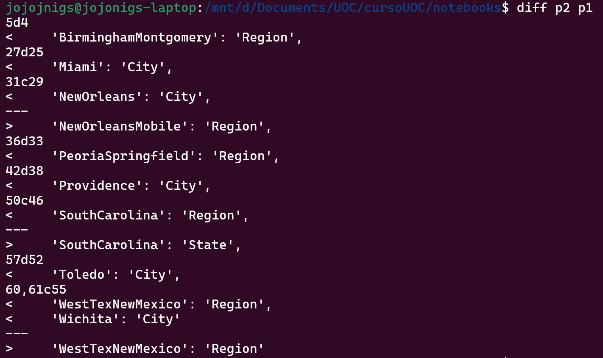

*   el dataset actualizado tiene 53.415 filas versus los 18.250 filas del proyecto 1.
*   para verificar que los datos originales no difieren con los datos actualizados hasta la fecha final del proyecto 1:

1.   contamos las filas del csv actualizado hasta la ultima fecha del proyecto 1 que era del 2018-03-25: 18.360 filas, puesto que habia unos regionas nuevos.
2.   comparamos la evolución del 'AveragePrice' y vemos que el gráfico sigue el mismo patron. (Hicimos e mismo ejercicio con Total Volume).

**Average Price 2015-2018**

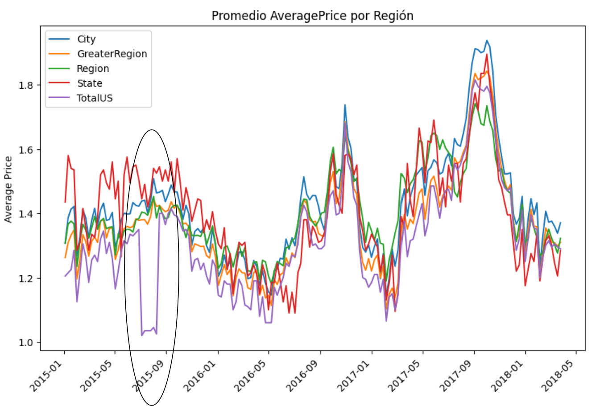

**Average Price 2015-2023**

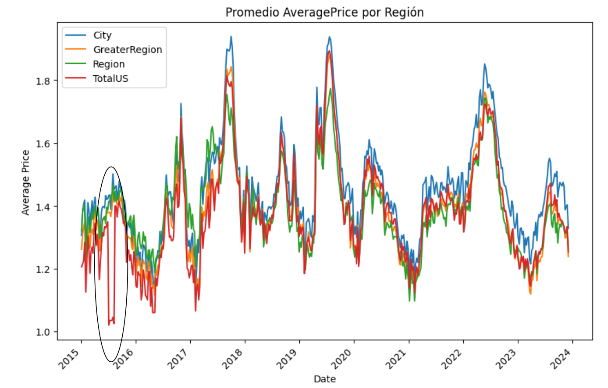

*   Precio Medio por año - observamos los **outliers** en el año 2017, como consequencia de varios anomalies que ocurió (sequía, tarifas en las importacioes, etc) pero lo que podemos observar es la diferencia en los precios entre avocados organicos versus convencionales, siendo los avocados convencionales con menor precio de forma consistente.

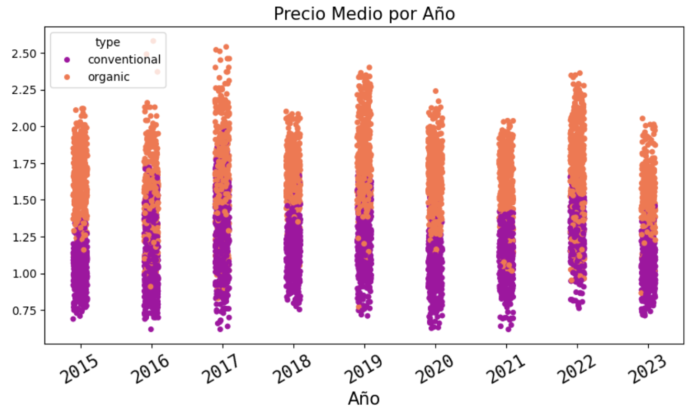

**Heatmap**

*   Presentamos el Heatmap contra AveragePrice y vemos la correlación negativa con Total Volume
*   Tambien observamos alta correlación entre el avocado plu4046 as Total Volume.

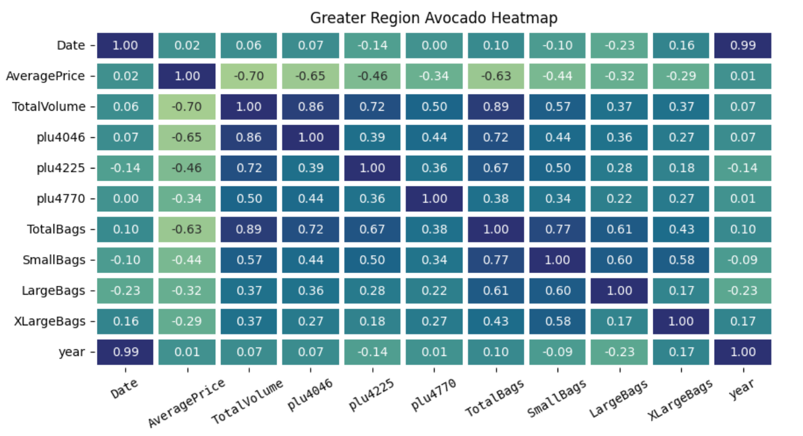

**Violin Plot**

*   Aqui mostramos el violin plot de Total Volume por Greater Region, y seguimos con el patrón de California y West con mas volumen de consumo.


*   evolución del Average Price, vemos los outliers durante los añps 2016-2017, ya presentado en proyecto-1

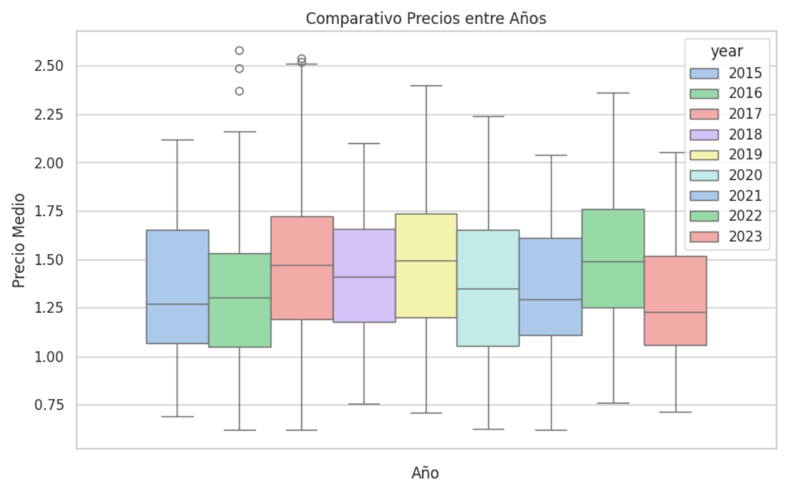

**Detección de Anomalias en los datos**

*   Detectamos ausencia de datos de las ventas por bolsas:

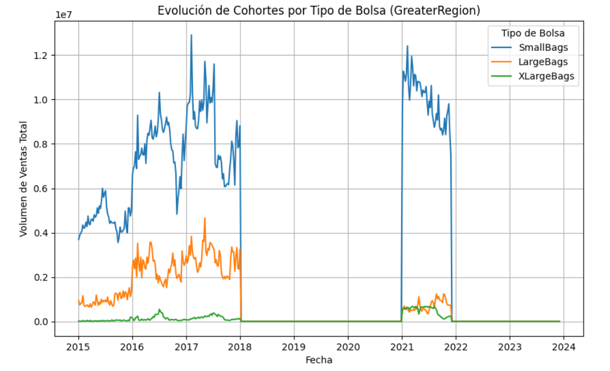

*   En consecuencia, decidimos concentrar en los volumenes por códigos de productos PLU para el estudio de cohortes y regresión

**Modelos de Regresion y Cohortes de soporte**:

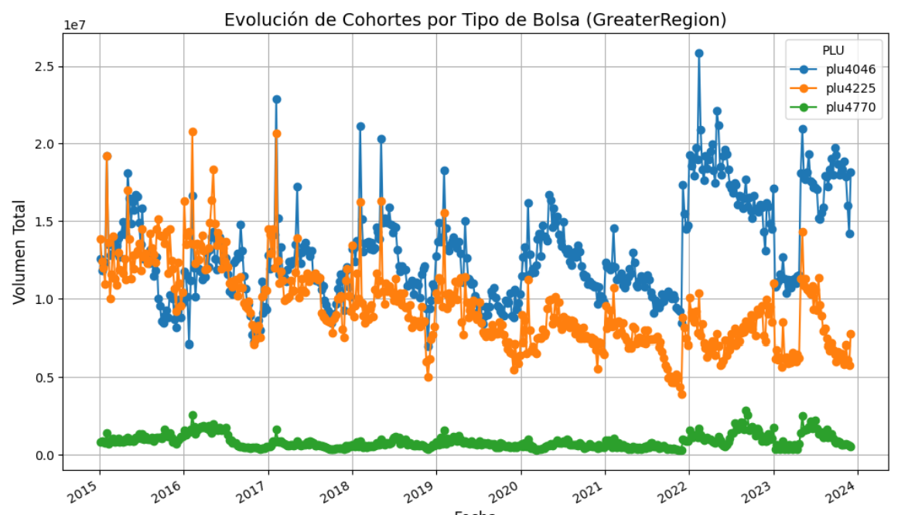

**Desglose de PLU:**

*   **PLU 4046 (Línea azul):** muestra fluctuaciones significativas y un aumento general a lo largo del tiempo, con varios picos y caídas pronunciadas. Esto sugiere que este tipo de aguacate tuvo períodos de alta demanda o eventos de ventas importantes.
*   **PLU 4225 (Línea naranja):** también presenta fluctuaciones, pero muestra una tendencia ligeramente decreciente después de 2020. Los volúmenes parecen más estables en comparación con el PLU 4046, pero, en general, la línea naranja tiende a la baja.
*   **PLU 4770 (Línea verde):** tiene volúmenes de ventas consistentemente bajos en comparación con los otros dos PLUs. Esto sugiere que este tipo (o tamaño) de aguacate es mucho menos popular o disponible.

**Patrones observados:**

**Estacionalidad:**  
Tanto el PLU 4046 como el PLU 4225 exhiben picos y valles estacionales (altos y bajos), que probablemente reflejan patrones estacionales de demanda y oferta de aguacates.

**Tendencias a lo largo del tiempo:**

*   El volumen total del PLU 4046 ha aumentado en los últimos años (especialmente después de 2021), lo que podría reflejar una mayor demanda de este tipo de aguacate.
*   El PLU 4225 ha experimentado una disminución en las ventas después de 2020, lo que sugiere una reducción de la demanda o problemas de suministro.
*   El PLU 4770 se mantiene plano y bajo, mostrando una participación de mercado o preferencia mínima.

**Volatilidad:**  
Los dos PLUs principales (4046 y 4225) muestran alta volatilidad, con picos frecuentes. Esto podría deberse a factores como:

*   Promociones o campañas de marketing.
*   Disrupciones en la cadena de suministro.
*   Variaciones estacionales (temporadas de cosecha).

**Interpretaciones potenciales:**

**Popularidad de los PLU:**

*   El PLU 4046 parece estar creciendo en popularidad o disponibilidad en comparación con el PLU 4225.
*   El PLU 4770 sigue siendo un producto de nicho con un impacto mínimo.

**Dinámicas del mercado:**  
Los picos y caídas podrían indicar cadenas de suministro inestables, cambios en precios competitivos o factores externos como el clima o problemas comerciales.

**Cambio de tendencia post-2020:**  
Las tendencias posteriores a 2020 podrían reflejar los efectos de la pandemia en la producción, el transporte o las preferencias del consumidor.

**Aplicando Ridge Regression**

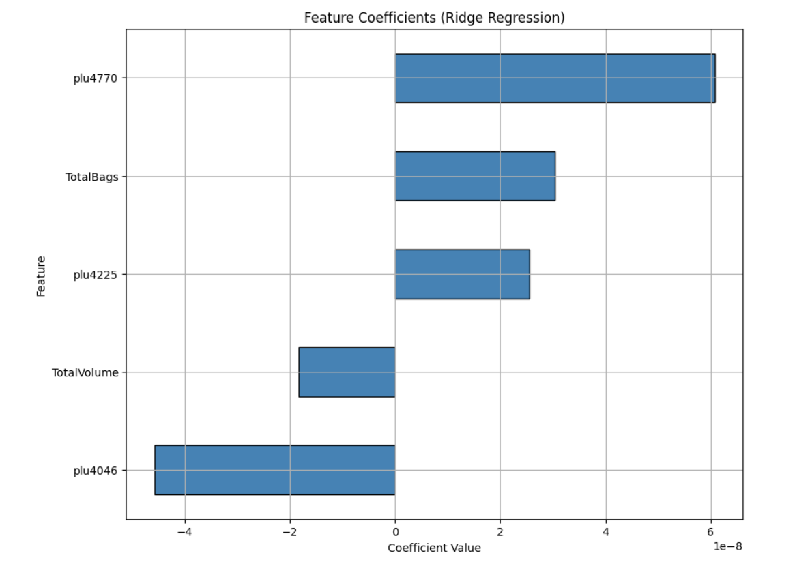

Este gráfico de coeficientes de la regresión Ridge te ayuda a comprender cómo cada característica (tipos de PLU y volúmenes) influye en la variable objetivo predicha (probablemente el precio promedio de los aguacates u otra métrica relacionada). Así se conecta con tu análisis:

**Observaciones Clave:**

**PLU 4770 (Influencia Positiva):**

*   El coeficiente positivo más grande sugiere que un aumento en los volúmenes de PLU 4770 está fuertemente asociado con un aumento en la variable objetivo.
*   Aunque PLU 4770 mostró un menor volumen total de ventas en tu análisis de cohortes anterior, su efecto en la regresión es sustancial. Esto podría indicar que los aguacates bajo este PLU tienen precios más altos o ejercen una influencia única en el mercado.

**PLU 4046 (Influencia Negativa):**

*   Un coeficiente negativo significativo para PLU 4046 sugiere que los aumentos en el volumen de este PLU conducen a una disminución en la variable objetivo predicha.
*   Esto se alinea con el análisis de cohortes anterior, donde PLU 4046 presentó volúmenes de ventas más altos, lo que podría indicar precios más bajos (una tendencia común cuando la oferta es alta).

**Volumen Total (Ligeramente Negativo):**

*   El coeficiente negativo pequeño implica que el volumen total de ventas de aguacates tiene un efecto marginalmente a la baja en la variable objetivo. Esto se alinea con la economía de oferta y demanda: una mayor oferta podría reducir los precios.

**PLU 4225 y Bolsas Totales (Influencia Positiva):**

*   Ambas características tienen coeficientes positivos, lo que indica que sus volúmenes incrementan ligeramente la variable objetivo.
*   Sin embargo, su impacto es mucho menor en comparación con PLU 4770.

---

**Conexión con el Análisis de Cohortes:**

**PLU 4046:**

*   El análisis de cohortes mostró volúmenes de ventas altos y volátiles para PLU 4046.
*   En la regresión Ridge, su coeficiente negativo sugiere que estos altos volúmenes se correlacionan con precios más bajos, reforzando su papel como un aguacate común y posiblemente de menor precio.

**PLU 4770:**

*   En el análisis de cohortes, PLU 4770 presentó volúmenes mínimos pero niveles consistentes.
*   En la regresión Ridge, su fuerte coeficiente positivo indica que incluso pequeños cambios en los volúmenes de PLU 4770 tienen un gran impacto positivo, probablemente debido a precios más altos o exclusividad.

---

**Perspectivas Generales:**

*   Las características con mayor importancia en el modelo Ridge (como PLU 4770 y PLU 4046) se alinean bien con las tendencias observadas en el análisis de cohortes.
*   Los PLU influyen en la variable objetivo de manera diferente según sus dinámicas de mercado (por ejemplo, mayor oferta = precios más bajos para PLU 4046).

**Seleccionar los mejores modelos mediante validación cruzada con k-fold, para asegurar la robustez y generalización de los modelos creados**

**Definir los modelos**: Ridge, Lasso y ElasticNet como modelos base.

**Configurar la validación cruzada**:

*   Seleccionaremos un valor de `k` para el k-fold (comúnmente k=5 o k=10).
*   Utilizaremos `cross_val_score` o `GridSearchCV` para obtener la métrica de evaluación (RMSE o R^2).

**Optimizar los hiperparámetros**: Realizaremos una búsqueda de los mejores hiperparámetros mediante `GridSearchCV`.

**Seleccionar el mejor modelo**: Compararemos las métricas obtenidas (promedios de validación cruzada) y seleccionaremos el modelo con el mejor rendimiento

**Salida**

```
Modelo: Ridge
Mejores Hiperparámetros: {'alpha': 100}
RMSE Promedio de CV: 0.1495

Modelo: Lasso
Mejores Hiperparámetros: {'alpha': 0.01}
RMSE Promedio de CV: 0.1497

Modelo: ElasticNet
Mejores Hiperparámetros: {'alpha': 0.01, 'l1_ratio': 0.1}
RMSE Promedio de CV: 0.1496

RMSE en Test del Mejor Modelo: 0.3846
```